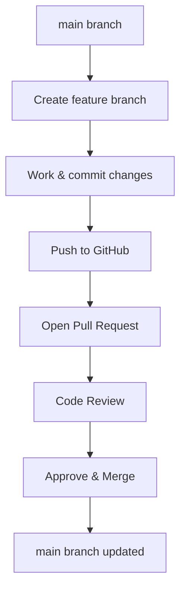

# Git and GitHub Lab
This lab provides a practical introduction to using Git and GitHub, covering everything from account setup and Git installation to real-world collaboration using feature branches and pull requests (PRs). It includes step-by-step instructions, key commands, and an illustrated overview of the industry-standard PR model.

## Table of Contents

- [Lab Overview](#lab-overview)
- [Prerequisites](#prerequisites)
- [Step 1: GitHub Account Creation](#step-1-github-account-creation)
- [Step 2: Git Installation](#step-2-git-installation)
- [Step 3: Initializing and Cloning Repositories](#step-3-initializing-and-cloning-repositories)
- [Step 4: Standard Git Workflow](#step-4-standard-git-workflow)
- [Step 5: Industry PR Model with Feature Branches](#step-5-industry-pr-model-with-feature-branches)
- [Best Practices](#best-practices)
- [Resources](#resources)

---

## Lab Overview

| Section   | Details                                                                 |
|-----------|------------------------------------------------------------------------|
| Objective | Learn Git basics, GitHub account setup, and real-world collaboration    |
| Outcome   | Ability to create repos, branches, PRs, and understand team workflows   |

---

## Prerequisites

- Internet access
- Basic command line knowledge

---

## Step 1: GitHub Account Creation

1. Go to [https://github.com/join](https://github.com/join)
2. Fill in your email, username, and password.
3. Verify your email and complete the signup steps.
4. (Optional) Set up 2FA (two-factor authentication) for better security.

---

## Step 2: Git Installation

### For Windows:
- Download [Git for Windows](https://git-scm.com/download/win) and follow the installer.

### For macOS:
```bash
brew install git
```
Or download from [git-scm.com](https://git-scm.com/download/mac).

### For Linux:
```bash
sudo apt update
sudo apt install git
```

### Verify installation:
```bash
git --version
```

---

## Step 3: Initializing and Cloning Repositories

### Initialize a New Repository
```bash
git init my-first-repo
cd my-first-repo
echo "# My First Repo" > README.md
git add README.md
git commit -m "Initial commit"
```

### Clone an Existing Repository
```bash
git clone https://github.com/<username>/<repo>.git
cd <repo>
```

---

## Step 4: Standard Git Workflow

| Step             | Command Example                               | Description                       |
|------------------|-----------------------------------------------|-----------------------------------|
| Check status     | `git status`                                  | See current changes               |
| Create branch    | `git checkout -b feature/my-feature`          | Make a new feature branch         |
| Make changes     | `nano app.py`                                 | Edit code                         |
| Stage changes    | `git add app.py`                              | Add files to commit               |
| Commit changes   | `git commit -m "Add new feature"`             | Save changes                      |
| Push branch      | `git push origin feature/my-feature`           | Upload branch to GitHub           |

---

## Step 5: Industry PR Model with Feature Branches

### Typical PR Workflow

1. **Create a feature branch off main**  
   `git checkout -b feature/my-feature`
2. **Work on the feature, commit, and push**  
   `git add . && git commit -m "..." && git push origin feature/my-feature`
3. **Open a Pull Request (PR) on GitHub**
4. **Code review & feedback from team**
5. **Make corrections and push again if needed**
6. **Merge PR after approval**  
   (Often, only maintainers can merge into `main`)

### Diagram: PR & Feature Branch Workflow



**Key Points:**
- Never commit directly to `main`
- Use descriptive branch names, e.g., `feature/login-auth`
- PRs allow for code review, CI checks, and discussion before merging

---

## Best Practices

| Practice            | Description                                                   |
|---------------------|--------------------------------------------------------------|
| Commit often        | Make small, frequent commits                                 |
| Write clear messages| Summarize the "what" and "why" in your commit messages       |
| Use .gitignore      | Exclude unnecessary files from version control               |
| Rebase if needed    | Clean up history before merging (advanced)                   |
| Protect main branch | Enable branch protection rules on GitHub                     |

---

## Resources

| Resource                        | Link                                           |
|----------------------------------|------------------------------------------------|
| GitHub Docs                     | https://docs.github.com/                       |
| Git Book                        | https://git-scm.com/book/en/v2                 |
| GitHub Flow                     | https://docs.github.com/en/get-started/quickstart/github-flow |
| Learn Git Branching (visualizer)| https://learngitbranching.js.org/              |
